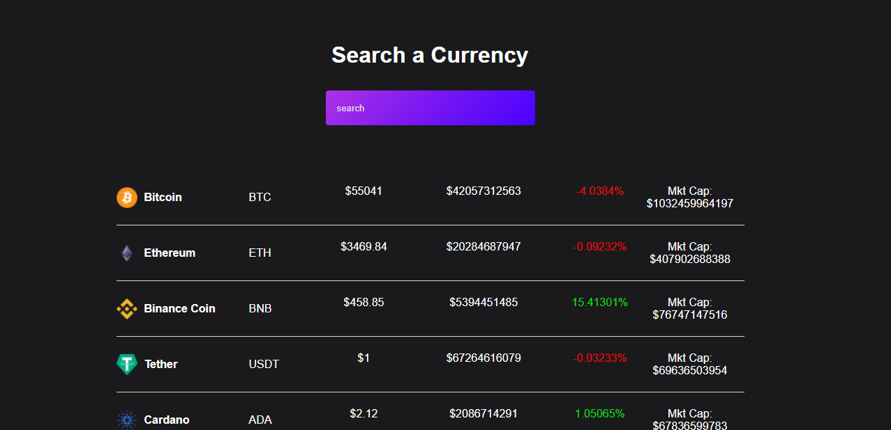

## Project Cryptocurrency-Api

### The goal of this project is to create a cryptocurrency finance price tracker app with React.We will use React Hook(mainly use useEffect and useState) and Axios(Optional) for this project. 

**Basic functionality:** You will be able to search currencies and have it display on the browser. Also, the prices will be updated live whenever you refresh the page. We will get all of the data from a public API. .

A simple example looks like this:  

 

---

### Step by Step Instruction

1. Create a new project on your local computer using `npx create-react-app project-cryptocurrency'
1. Delete the css from the App.css and index.css files and use `index.css` for your css (look at your previous projects how you set the initial general CSS)
1. Delete the code in the App.js file between `<div className="App">` and the closing `</div>`
1. In the `return` of the component, add `<h1>Search Currency</h1>` to test the component and
1. Create a search input into a form that will help you to find currency by there name.
1. To test if your React app is working, make sure you are in the project folder in your terminal and type `npm start` (you should see the text "Search Currency?" as title on the page)
1. Create a `components` folder inside your `src` folder
1. Create a functional component **Coin.js** inside this file (remember the React syntax!) and a `css ` file in same name.
1. In the component **Coins** create a `</div>` where you gonna target all the values from the API to be manupulated 
1. This API has enormous values but for practice you are using six value like(id,name,symbol,current_price,total_volume,image,price_change_percentage_24h,market_cap)

### For Fetching API
 
1. Use `Use effect` to fetch the data from the following  API

```js
fetch("https://api.coingecko.com/api/v3/coins/markets?vs_currency=USD&order=market_cap_desc&per_page=100&page=1&sparkline=false")
```
1. You can also use `axios` for fetching data.In such case you have to install `axios` library and also import hook like `import axios from "axios"` to make it run.And instead of `fetch("")`
syntax you have to use `axiox.get("")` to get the data. You can read more about axios in the following link Click [here](https://www.npmjs.com/package/axios)

1. Create a `div` with class name `coin-app`.
1. Create two hooks one  with `coin` and `setCoin` and set the state with `empty[]` as default another one with `search`and `setSearch` and set the state `empty ""`
1. Create a `handleChange()` function that uses the `setSearch` hook to filtered the currency 
1. Create a `filteredCoins()`function that would use the `coins` hook to filttered the actual coin and display us whatever we typed.
1. This `filteredCoins` function will be used a map function with a parameter `coin` and pass the `Coin.js` component with props in return .
1. After displaying all data you can use both `app.css` and `coin.css` to design it more interactively on your own taste.

1. **If you would like to build this app with more value from the API** just add more column and add with more values from the api  

### EXTRA SPECIAL NOTE:
Use this extension `ES7 React/Redux/GraphQL/React-Native snippets` in your VS code this will allow you to make a component automatically within 2 second only by using this commond `rface`.

## Please note:
If you want to download a project on your local machine, do not fork it but clone the repo locally, on your computer. After that, create a new repo in your own GitHub account *with exactly the same project name*, and link the local repo to the remote repo in your GitHub account (see below). Why should you clone and not fork? It will show the project as **your own project** and not a fork of someone else's project. You can use it as a project for your portfolio.

You can connect a local project to a new, empty GitHub repo [as follows](https://docs.github.com/en/github/importing-your-projects-to-github/adding-an-existing-project-to-github-using-the-command-line). We can do this together during a CodeWomen coding session: it is very good to know this so that you can start a project locally and afterwards link it with a remote GitHub repo.

If you clone the project without forking it, you will have to change the 'remote origin' repository after cloning. Check the remote of your local project using `git remote -v`. You will probably see:  
`origin  https://github.com/CodeWomen-Barcelona/some-codewomen-project.git (fetch)`  
`origin  https://github.com/CodeWomen-Barcelona/some-codewomen-project.git (push)`

To link your local project to your own GitHub repo, you need to change the remote origin. Have a look at this article: https://devconnected.com/how-to-change-git-remote-origin/. With `git remote -v` you can again check if remote origin has been reset and now shows the name of your GitHub account.


PS: if you work for a company that has a corporate social responsibility policy and wants to support women in tech, then here is the link to the [fundraising overview of MigraCode](https://docs.google.com/spreadsheets/d/1Zs-Mmi39bcjVw2U-iEQWSHSjkb-EmET-j1WB2oJF45Q/edit#gid=0).

---
